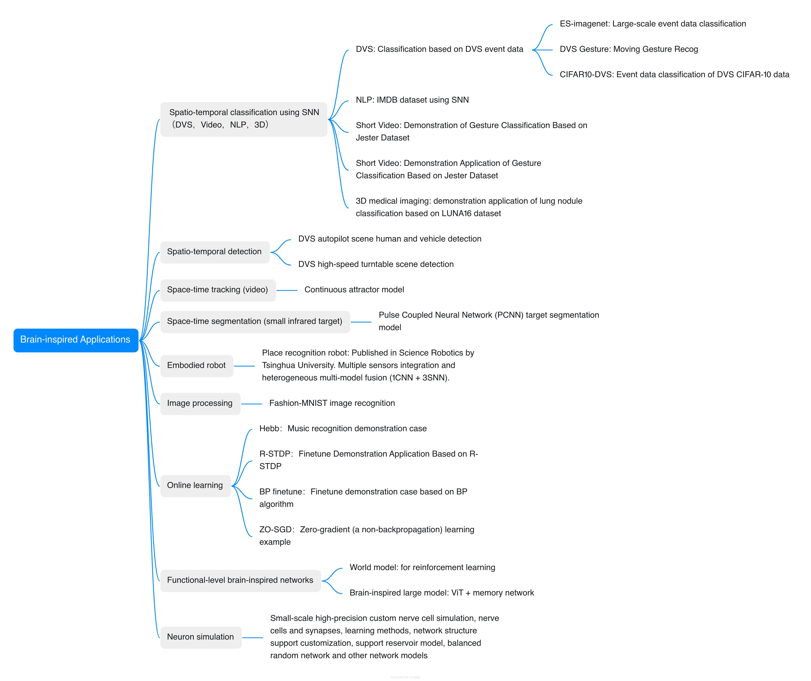

[BIDL User Manual] (https://bidl-user-manual.readthedocs.io/en/latest/) | [Chinese ReadMe](https://github.com/LynxiTech/BIDL/blob/main/README_zh.md)

## 
What is BIDL?

BIDL represents a sophisticated development platform tailored for the training of brain-inspired deep learning networks, a collaborative initiative between Lynxi Technology and the Nanhu Research Institute. This platform is architecturally grounded in the PyTorch deep learning framework and is fully compatible with the comprehensive suite of Lynxi's brain-inspired computing platforms.

BIDL supports high-precision Backpropagation Through Time (BPTT) training methodologies for varieties of applications. This capability not only facilitates the training of conventional Spiking Neural Network (SNN) models but also enables the seamless integration of traditional deep learning network layers, thereby facilitating the construction and training of heterogeneous fusion networks. Within the BIDL, users retain the autonomy to define custom neuron implementations, thereby enhancing the platform's adaptability and versatility. 

The design of BIDL is meticulously aligned with the computational characteristics of Lynxi's brain-inspired systems. Consequently, the trained networks can be automatically compiled and deployed within Lynxi's brain-inspired computing environment, ensuring efficient inference performance. The core innovation of BIDL lies in its exploitation of the temporal information processing capabilities of neurons to construct lightweight networks adept at handling diverse spatiotemporal data. This approach notably reduces computational overhead compared to networks constructed using Conv3D or ConvLSTM architectures, rendering BIDL particularly well-suited for high-efficiency spatiotemporal processing tasks.

The architectural framework of the BIDL platform is illustrated in the following figure.

## 
Native supports for Lynxi brain-inspired chips 

All network models included in the BIDL framework can be trained and inferred on both Nvidia GPUs and CPUs, and can run inference on the Lynxi series platforms (online-learning related cases can achieve training on chip). The Lynxi series platforms include the brain-inspired server (SL-800), brain-inspired computing cards (HP-280, HP-300), edge computing boxes (HS-110, HS-100, HS-120), and chip modules (HM-100).

## 
Principles Introduction

BIDL provides a unified DSNN design flow for a range of STP applications, including video clip processing, moving trajectory processing, dynamic vision sensor (DVS) recognition, 3D medical imaging classification, and NLP task. These experiments demonstrate the efficiency of BIDL, achieving high accuracy while consuming significantly less computation than traditional convolutional 3D (Conv3D) or LSTM approaches. BIDL facilitates the exploration of various differentiable neural models such as the leaky integrate-andfire (LIF) and LIF+ models. It also supports different neural configurations, including analog spike and residual membrane potential (RMP). Furthermore, BIDL enables global-local colearning through the use of back-propagation through Time (BPTT) for global learning and generalized synaptic plasticity rules for local learning. To ensure compatibility with brain-inspired chips and GPUs, the BIDL framework incorporates both internal iteration and external iteration of timesteps into a unified design flow. Additionally, we propose a tate-variable indicated computational graph as a representation of the networks, which facilitates seamless integration with downstream SNN compilers.

BIDL treat all spatiotemporal source signals as spatiotemporal tensors. These tensors contain both spatial and temporal information, forming a spatio-temporal (ST) tensor with the shape [B, T, C, H, W]. In this study, B represents the batch
size, T denotes the total timesteps, H and W represent height and width, respectively, and C denotes the number of channels.
This spatiotemporal tensor format allows the representation of spatial information in [C, H, W] and temporal information with T timesteps.BIDL requires a data pre-processing procedure to convert the source data into the ST tensor format, as illustrated in the figure below 

 
For high-accuracy spatiotemporal processing, BIDL utilizes a DSNN, where ANN layers and SNN layers are interleaved and stacked in a network. With the advantages of deep learning technologies, ANN layers, including convolution, batch normalization, pooling, dropout, linear, residual connections, and attention mechanisms, are proficient in spatial (image) processing. Additionally, the backbone network of DSNN can be directly adopted from DNN, such as ResNet or VGG. On the contrary, SNN layers, such as LIF, can be inserted into these DNNs to introduce temporal processing capability. Therefore, ANN layers are responsible for spatial processing, while SNN layers handle temporal processing. It has been demonstrated that the neural dynamics of these neural models can effectively extract temporal information. In particular,the ConvLIF is an ST block that incorporates convolution, batch normalization, and LIF, making it suitable for lightweight spatiotemporal processing. The ConvLIAF block is an improved ST block that replaces spike activations with analog activations while maintaining the neural dynamics of LIF, thereby enhancing spatial signal transfer accuracy. These ConvLIF/ConvLIAF blocks can be considered as the fundamental building blocks for constructing spatiotemporal networks, as shown in the figure below 

BIDL also leverage basic backbone networks from DNN designs and insert neural models to enable temporal processing, such as ResNet-LIF or VGG-LIAF. These networks can be trained in BIDL using global learning methods, such as BPTT, or learned through local learning methods, such as Hebb or spiketiming-dependent plasticity (STDP). BPTT provides high-accuracy processing through supervised learning, while local methods offer unsupervised or weakly supervised learning, which can be used for adapting to new tasks or environments. 

Most brain-inspired chips operate in a timestep driven manner, where a timestep iteration is located outside the neural network. The device computes all the layers in each timestep and then switches to the next timestep. In contrast, GPU-based SNN frameworks usually locate the timestep iteration within each layer, resulting in outputs with an extra temporal dimension. To address this difference, we designed two modes of operation: internal iteration mode (IIM) and external iteration mode (EIM), shown below.

## 
Installation Instructions

### Nanhu brain Cloud Machine (Equipped with Lynxi chip) 
- Please write an E-mail to Nanhu Brain (nanhubrain@cnaeit.com) for applying the cloud image. This image can be used to run on Lynxi brain-inspired computing servers. Please specify "Application for the Cloud Machine with BIDL image" in E-mail title. Note this machine can not perform network training since no GPU card is available.

### CPU install dependencies
- Install a virtual environment for Python 3.8
- Install PyTorch version 2.4.0 on cpu. Run: 
  pip install torch==2.4.0 torchvision==0.19.0 torchaudio==2.4.0 --index-url https://download.pytorch.org/whl/cpu
- pip3 install -r requirements.txt
  Note：For installing the environment for dreamerv2, please refer to its readme files.

### GPU install dependencies
- Install a virtual environment for Python 3.9
- Install the GPU version of Pytorch, for example, CUDA version 12.1 and select torch version 2.4. 
  You can find the installation command on the PyTorch official website's previous versions page at 
  https://pytorch.org/get-started/previous-versions/. The command is as follows:
  pip install torch==2.4.0 torchvision==0.19.0 torchaudio==2.4.0 --index-url https://download.pytorch.org/whl/cu121
- pip3 install -r requirements.txt
  Note：For installing the environment for dreamerv2, please refer to its readme files.

### Pytorch installation in Nvidia Xavier device
- export TORCH_INSTALL=https://developer.download.nvidia.cn/compute/redist/jp/v511/pytorch/torch-2.0.0+nv23.05-cp38-cp38-linux_aarch64.whl
- python3 -m pip install --no-cache $TORCH_INSTALL
- pip install triton

### Setup dataset packages and compiled models 
The link address of the resource pack is: https://pan.baidu.com/s/1CZm98m290lkdicHoz-TS1g?pwd=sm37
Extraction code: sm37

The model compilation artifacts files are located in the "model_files" folder under the path.

The weight files are located in the "weight_files" folder under the path.

The dataset is located in the "data" folder under the path.

The deployment files are located in the "deploy" folder under the path.

## 
 Brain-inspired applications

BIDL includes a rich set of applications, including spatiotemporal classification models, video detection and tracking, robotics, and functional-level brain-inspired applications.

The brain-inspired neuronal simulation toolkit in the special applications has the following features:  
(a) Supports building neuron clusters using PyTorch for simulating the dynamics of one or multiple neuron clusters.     
(b) Can build LIF, Izhikevich, LIF+, AdEx, Hodgkin-Huxley, multi-compartment, and electrical synapse neuron models.   
(c) Allows users to construct new custom neuron models.     
(d) Supports BP training (offline) to obtain optimal neuron parameters, and supports neural networks built using the above and custom neuron models.  
(e) Supports fully automatioic compilation using Lyngor and scheduling and input/stimulation source configuration using LynSDK for multiple time steps.   
(f) Supports analysis of firing results and membrane potential results, such as Raster plots, Fire Rate, CV ISI, Pearson Correlation, and time-series analysis of neuronal state information (such as membrane potential).

### Applications

- [classification applications English README](./applications/classification/README.md) 
  [Chinese README](./applications/classification/README_zh.md) 

- [detection English README](./applications/dvsdetection/st-yolo/README.md)
  [Chinese README](./applications/dvsdetection/st-yolo/README_zh.md)

- [neuronsim English README](./applications/neuralsim/neurons/README.md)
  [Chinese README](./applications/neuralsim/neurons/README_zh.md)

- [onlinelearning English README](./applications/onlinelearning/README.md)
  [Chinese README](./applications/onlinelearning/README_zh.md)

- [video tracking English README](./applications/videotracking/CANN/README.md)
  [Chinese README](./applications/videotracking/CANN/README_zh.md)

- [place recog English README](./applications/robotics/placerecog/README.md)
  [Chinese README](./applications/robotics/placerecog/README_zh.md)

- [dreamerv2 English README](./applications/functionalBII/worldmodel/dreamerv2/README.md)
  [Chinese README](./applications/functionalBII/worldmodel/dreamerv2/README_zh.md)

- [pcnn English README](./applications/dvsdetection/pcnn/README.md)
  [Chinese README](./applications/dvsdetection/pcnn/README_zh.md)

- [associative_memory English README](./applications/functionalBII/memory/vitmem/README.md)
  [Chinese README](./applications/functionalBII/memory/vitmem/README_zh.md)

- [tutorial English README](./tutorial/build_snn_from_scratch_pytorch/snn_tutorial.md)
  [Chinese README](./tutorial/build_snn_from_scratch_pytorch/snn_tutorial_zh.md)

- [frameworkfree-runtime English README](./deploy/README.md)
  [Chinese README](./deploy/README_zh.md)

## 
References

Related paper - BIDL: a brain-inspired deep learning framework for spatiotemporal processing (https://www.frontiersin.org/journals/neuroscience/articles/10.3389/fnins.2023.1213720/full)

