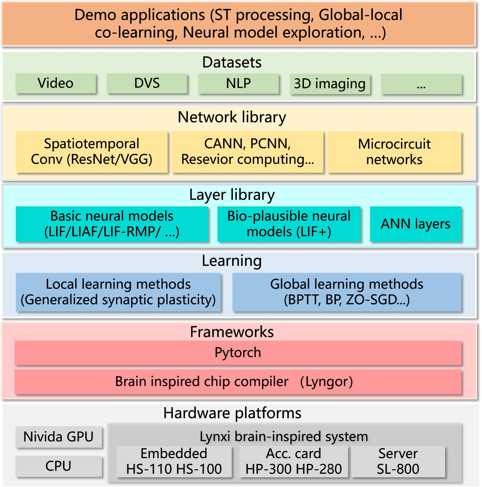
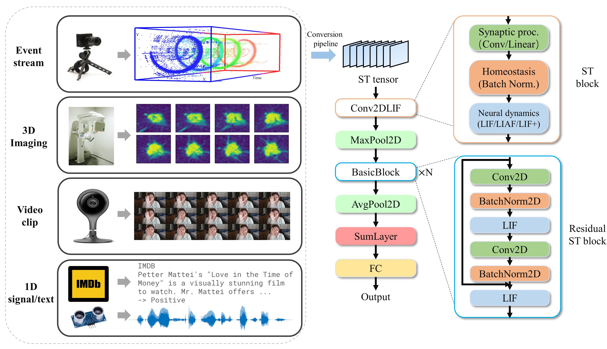
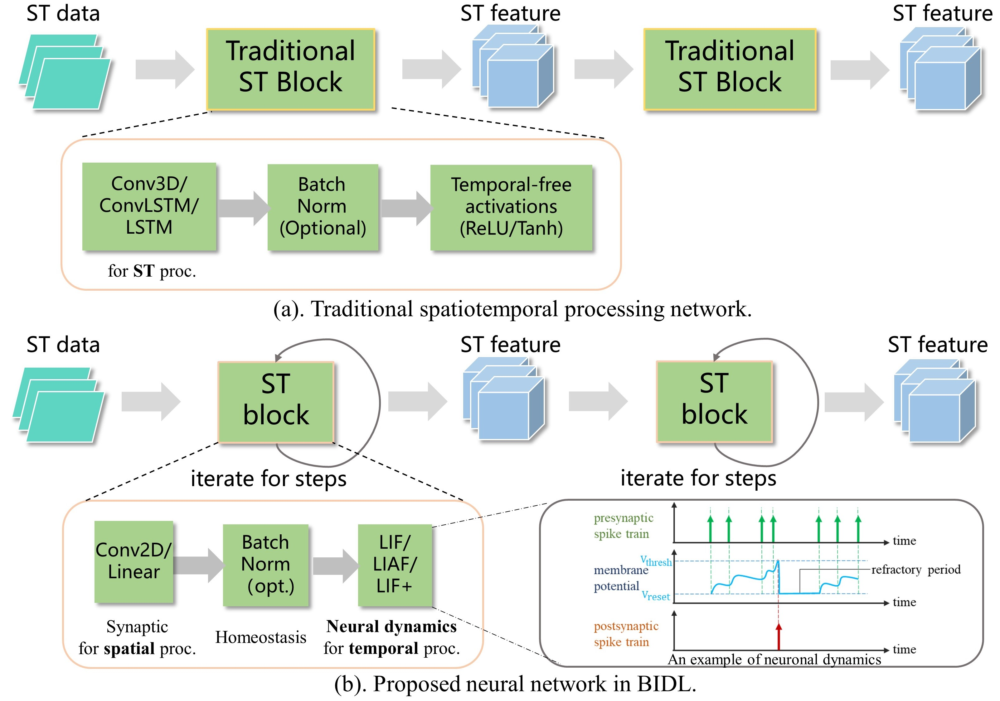
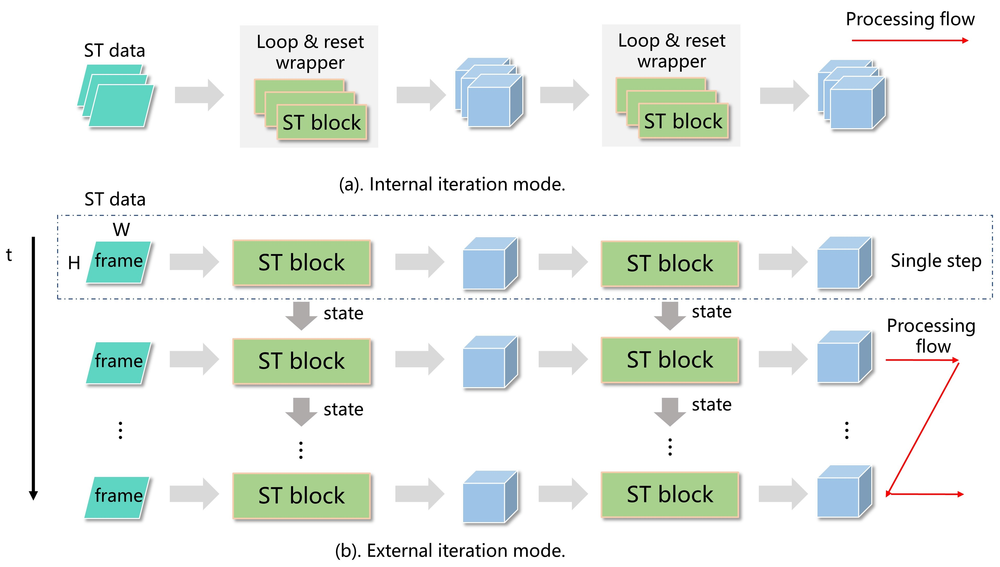
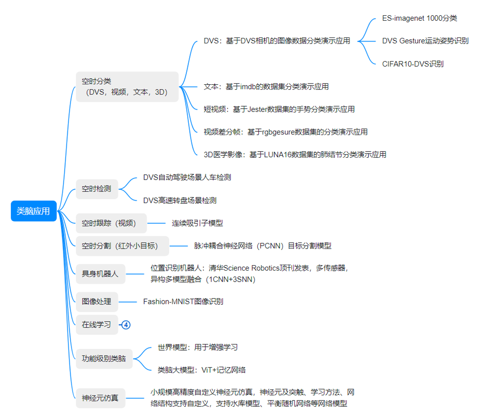

## 
BIDL是什么

[BIDL 用户手册] ( https://github.com/LynxiTech/BIDL_doc_zh) | [English ReadMe](./README.md)

## 
BIDL是什么

BIDL是由灵汐科技与南湖研究院联合开发的一套用于训练类脑深度学习网络的应用开发平台，其基于深度学习框架Pytorch构建，并实现了对灵汐类脑计算全系列产品的支持。
  
BIDL支持高精度的BPTT训练方法及多种本地学习方法，可用于训练典型的SNN模型，并可与传统的深度学习网络层混合使用，实现异构融合网络构建和训练。其中神经元模型支持LIF和LIFplus，包括一维数据（1D）和帧数据（2D），支持脉冲发放形态和模拟值发放形态，用户也可以自行定义神经元内部实现。

该平台充分考虑了灵汐类脑计算系统的计算特性，训练后的网络可自动编译并部署于灵汐类脑计算系统，实现高效率推理。其特点是利用神经元本身的时序信息处理能力，构建的可用于空时处理的轻量级网络，开销较Conv3D或ConvLSTM构建的网络显著降低，从而可用于高效的空时处理任务。

BIDL平台的体系结构如下图所示。

## 
Lynxi芯片的深度支持

### 设备支持情况
BIDL框架所收录的所有网络模型都可以在Nvidia GPU、CPU完成训练和推理，并在灵汐系列平台上运行网络推理（片上学习相关案例可实现片上训练），灵汐系列平台包括类脑服务器（SL-800），类脑计算板卡（HP-280，HP-300），边缘计算盒子（HS-110， HS-100， HS-120），芯片模组（HM-100）等。

## 
运行原理简介

BIDL为一系列空时感知应用提供了统一的DSNN设计流程，包括视频片段处理、运动轨迹处理、动态视觉传感器（DVS）识别、3D医学影像分类和NLP任务等。这些实验展示了BIDL的高效性，在实现高精度的同时，相比传统的三维卷积（Conv3D）或长短期记忆（LSTM）方法，其计算消耗显著降低。BIDL促进了多种可微分神经模型的探索，如LIF模型和LIF+模型。它还支持不同的神经配置，包括RMP等。此外，BIDL通过时间反向传播（BPTT）进行全局学习，并通过广义突触可塑性规则进行局部学习，从而实现了全局-局部协同学习。为了确保与神经形态设备和GPU的兼容性，BIDL框架将时间步内部循环和时间步外部循环结合到统一的设计流程中。此外，我们提出了状态变量表示的计算图作为网络的表示方式，便于与下游SNN编译器的无缝集成。

BIDL中的神经网络将所有时空源信号视为时空张量。这些张量包含了空间和时间信息，形成一个具有形状[B，T，H，W，C]的时空（ST）张量。这里，B表示批量大小，T表示总的时间步长，H和W分别表示高度和宽度，C表示通道数。这种时空张量格式允许在(H，W，C)中表示空间信息，并用T个时间步长表示时间信息。BIDL需要一个数据预处理过程，将源数据转换为ST张量格式，如下图所示。

为了实现高准确度的时空处理，BIDL利用了DSNN，其中ANN层和SNN层交替堆叠在网络中。借助深度学习技术的优势，ANN网络层，包括卷积、BN、池化、dropout、线性、残差连接和注意机制等，在图像领域表现较为出色。此外，DSNN的骨干网络可以直接采用DNN中的结构，比如ResNet或VGG。另一方面，SNN层，如LIF，可以插入到这些DNN中，以引入时间处理能力。因此，ANN层负责空间处理，而SNN层处理时间处理。在BIDL框架中，ConvLIF是一个包含卷积、批归一化和LIF的ST块，适用于轻量级时空处理。ConvLIAF块是一个改进的ST块，将脉冲激活替换为模拟激活，同时保持LIF的神经动态，从而增强了空间信号传输的准确性。这些ConvLIF/ConvLIAF块可以被视为构建时空网络的基本构建块，如下图所示

BIDL还可以利用DNN设计的基本骨干网络，并插入神经模型以实现时间处理，例如ResNet-LIF或VGG-LIAF。这些网络可以通过全局学习方法（如BPTT）在BIDL中进行训练，也可以通过局部学习方法（如Hebb或Spike-Timing-Dependent Plasticity（STDP））进行学习。BPTT通过监督学习提供高准确度的处理，而局部方法提供无监督或弱监督学习，可用于适应新任务或环境.

原始的LIF模型用微分方程描述如下：
$$
\tau \frac{{\rm d}V(t)}{{\rm d}t}=-\left(V(t)-V_{\rm reset}\right)+RI(t)
$$
其中，τ 是神经元的时间常数, Vrest 是静息膜电位，I(t)是输入电流。当V(t) 超过阈值Vth, 会发放脉冲，膜电位V(t)被重置为初始膜电位。 
通过公式转化，获得LIF模型的离散化表示，BIDL中使用离散化的表示法用于模型推理和训练。

大多数神经形态学设备以时间步驱动的方式运行，在神经网络外部定位了一个时间拍循环。设备在每个时间步中计算所有层，然后切换到下一个时间步。相比之下，基于GPU的SNN框架通常将时间步循环定位在每个层内部，导致输出具有额外的时间维度。为了解决这种差异，我们设计了两种操作模式：内部循环模式（IIM）和外部循环模式（EIM）。如下图所示：

## 
安装说明

### 灵汐类脑计算板卡的南湖脑启云镜像
- 请向南湖脑启云（nanhubrain@cnaeit.com）申请，该镜像可以用于该平台在灵汐类脑计算服务器设备下运行。请注明"申请BIDL镜像"。

### CPU环境安装
- 安装python3.8的虚拟环境
- 安装pytorch 2.4.0 cpu版本的pytorch
  pip install torch==2.4.0 torchvision==0.19.0 torchaudio==2.4.0 --index-url https://download.pytorch.org/whl/cpu
- pip3 install -r requirements.txt
  说明：dreamerv2的环境需要参考其readme文件进行安装

### GPU环境安装
- 安装python3.9的虚拟环境
- 安装GPU版的Pytorch，比如CUDA版本是12.1，torch版本选择2.4.0，可在PyTorch官网的历史版本页面
  https://pytorch.org/get-started/previous-versions/ 中找到安装的命令，如下：
  pip install torch==2.4.0 torchvision==0.19.0 torchaudio==2.4.0 --index-url https://download.pytorch.org/whl/cu121
- pip3 install -r requirements.txt
  说明：dreamerv2的环境需要参考其readme文件进行安装

### NVIDIA Xavier盒子上pytorch的安装
- export TORCH_INSTALL=https://developer.download.nvidia.cn/compute/redist/jp/v511/pytorch/torch-2.0.0+nv23.05-cp38-cp38-linux_aarch64.whl
- python3 -m pip install --no-cache $TORCH_INSTALL
- pip install triton

### 资源包拷贝

资源包的链接地址为：https://pan.baidu.com/s/1CZm98m290lkdicHoz-TS1g?pwd=sm37 提取码：sm37 

模型编译生成物文件位于路径下的model_files文件夹

权重文件位于路径下的weight_files文件夹

数据集位于路径下的data文件夹

部署文件位于路径下的deploy文件夹

## 
类脑应用案例说明

BIDL包括了较为丰富的应用集合，包括空时分类模型、视频检测跟踪、机器人、功能级别类脑等一系列类脑特色应用。

类脑神经元仿真工具包具有以下功能：
(a) 支持采用Pytorch语言构建神经元簇，用于仿真一簇或多簇神经元的动力学特性  
(b) 可构建LIF、Izhikevich、LIF+、AdEx、Hodgkin-Huxley、多房室、电突触神经元模型  
(c) 用户可自行构建新型自定义神经元模型  
(d) 支持BP训练（离线）得到最优神经元参数，支持上述及自定义神经元模型构建的神经网络  
(e) 支持采用Lyngor实现全自动编译，及使用LynSDK进行多时间拍调度及输入、激励源配置  
(f) 支持发放结果和膜电位结果的分析，如Raster，Fire Rate，CV ISI，Pearson Correlation等统计曲线分析及神经元状态信息（如膜电位）的时序变化分析。  

#### 各个应用类别的Readme位于各个子路径下

- [分类应用 英文说明](./applications/classification/README.md)  [中文说明](./applications/classification/README_zh.md)

- [检测 英文说明](./applications/dvsdetection/st-yolo/README.md) [中文说明](./applications/dvsdetection/st-yolo/README_zh.md)

- [神经元仿真 英文说明](./applications/neuralsim/neurons/README.md) [中文说明](./applications/neuralsim/neurons/README_zh.md)

- [在线学习 英文说明](./applications/onlinelearning/README.md) [中文说明](./applications/onlinelearning/README_zh.md)

- [视频追踪 英文说明](./applications/videotracking/CANN/README.md) [中文说明](./applications/videotracking/CANN/README_zh.md)

- [位置识别 英文说明](./applications/robotics/placerecog/README.md) [中文说明](./applications/robotics/placerecog/README_zh.md)

- [dreamerv2 英文说明](./applications/functionalBII/worldmodel/dreamerv2/README.md) [中文说明](./applications/functionalBII/worldmodel/dreamerv2/README_zh.md)

- [pcnn 英文说明](./applications/dvsdetection/pcnn/README.md) [中文说明](./applications/dvsdetection/pcnn/README_zh.md)

- [联想记忆 英文说明](./applications/functionalBII/memory/vitmem/README.md) [中文说明](./applications/functionalBII/memory/vitmem/README_zh.md)

- [tutorial 英文说明](./tutorial/build_snn_from_scratch_pytorch/snn_tutorial.md) [中文说明](./tutorial/build_snn_from_scratch_pytorch/snn_tutorial_zh.md)

- [frameworkfree-runtime 英文说明](./deploy/README.md) [中文说明](./deploy/README_zh.md)

## 
参考文献

相关论文 BIDL: a brain-inspired deep learning framework for spatiotemporal processing (https://www.frontiersin.org/journals/neuroscience/articles/10.3389/fnins.2023.1213720/full)

